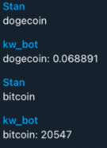

## Simple crypto-price bot for telegram

This bot gives you the price of given token from Coingecko

Coingecko API does not require any API keys

Don't forget to create .env file and add BOT_TOKEN value

`docker-compose up`

Sample input:

[-How do I create a telegram bot?](https://core.telegram.org/bots#3-how-do-i-create-a-bot)